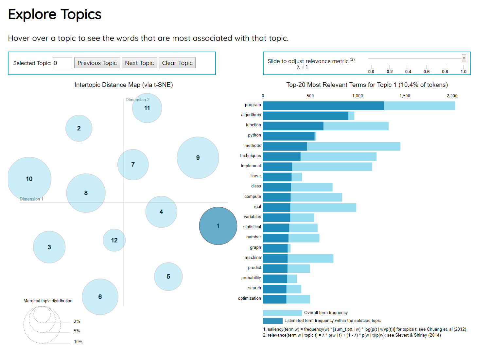
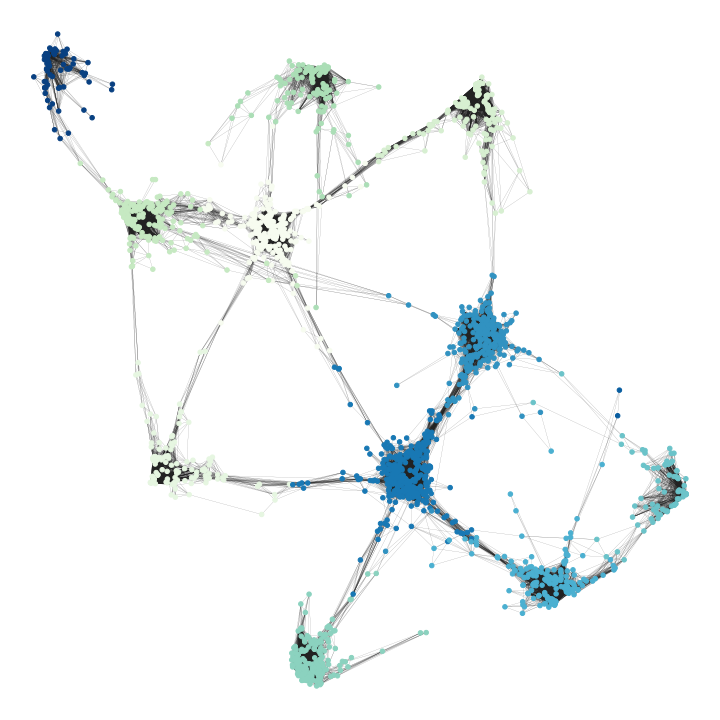

# edu-cater

## Customized course recommendations, catered to your needs!

Website: http://edu-cater.info

### Introduction:

edu-cater is a tool for custom course recommendations on Coursera. Course recommendations are often based on courses with highly similar content, but students may wish to select courses that are *somewhat* related to a skillset that they already possess, while also learning a new set of skills. This is where edu-cater comes in.

It uses topic modeling and graph theory to provide customized curricula of courses to users. The details of the process are described below.

### Setup and installation:

Run the following code to set up edu-cater:

`cd edu-cater`
`pip install -r requirements.txt`
`python setup.py`

### How does edu-cater work?

edu-cater involves the following steps:

#### 1) Preprocessing

Each course "document" consisted of the course title, description, and syllabus. Each document was then preprocessed. Preprocessing steps involved tokenizing, removing stopwords, lemmatizing, and stemming.

Next, a bag-of-words corpus was generated, and a dictionary of unique terms was defined. Terms appearing in fewer than 10 documents or more than 25% of documents were removed.

#### 2) Topic modeling

Topic modeling was then performed using Latent Dirichlet Allocation (LDA) in Python. Fourteen topics were defined, and were labelled manually based on the top words that were associated with each topic.

Topics were then visualized using `pyLDAvis` (shown below). The user can hover over a topic, and see the top 30 terms that are associated with that topic. The sizes of the circles reflect the marginal topic distribution.

</img>

#### 3) Graph theory

A network of courses was created. Each course is represented as a node in the network. Edges, or connections, between each pair of courses were defined as the cosine similarity of the topic scores for a pair of topics.  The graph was thresholded such that only the top 7.5% of connections were kept. This graph is shown here:

</img>

A separate graph was created for visualization purposes. This graph was thresholded and binarized to show the top 2.5% of connections. Courses that were connected to fewer than 15 courses were then discarded. The largest connected component of this resulting graph is what is visualized on the edu-cater website.

</img>

#### 4) Course recommendations

<b>User input</b>: The user inputs a topic that is familiar to them, and a topic they wish to learn. The user can determine these topics by using the interactive `pyLDAvis` plot and by browsing the topic names that were defined for each topic. The user can also rate the importance of course similarity, ratings, popularity, and length (number of hours it takes to complete the course).

<b>Behind the scenes</b>: The edges (weights) between courses are adjusted to be a weighted sum of course similarity, ratings, popularity, and length (based on the weightings defined by the user). These variables are first normalized between 0 and 1, and adjusted so that values closer to 1 indicate a higher cost (i.e. lower course similarity, lower ratings, lower popularity, and more hours required to complete the course are more costly). Then, the <b>shortest path</b>, a graph theory metric, is used to show the user the optimal path from the familiar topic to the new topic. The first and last courses in the path are defined by similarity to the familiar and new topics respectively, weighted by the weights that the user defines for course similarity, ratings, popularity, and length.

<b>Output</b>: The web app returns the "path" or curriculum of courses that has been optimized for the user. This path is also visualized on the course network graph (see below).

</img>
